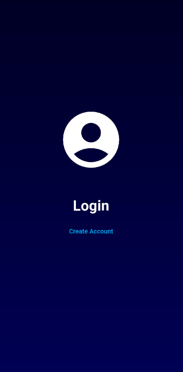
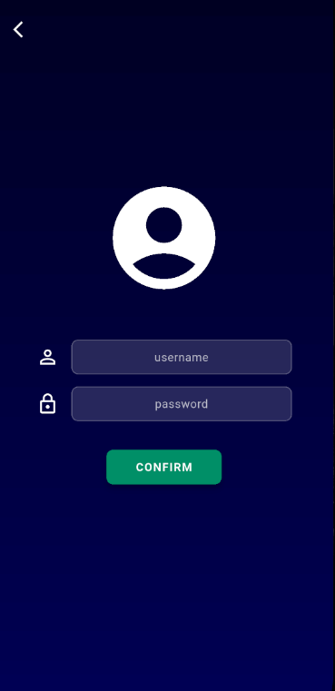
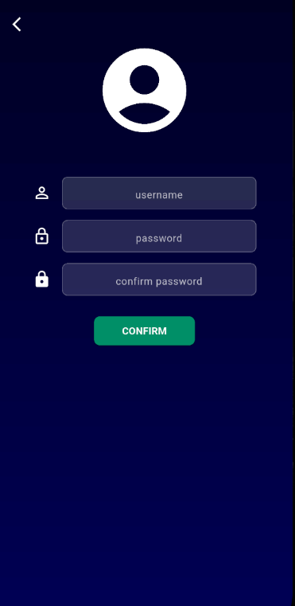
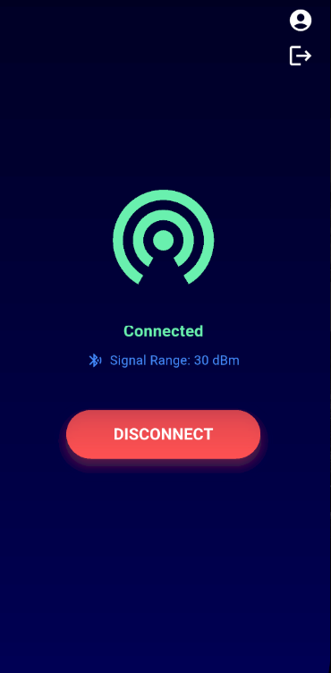
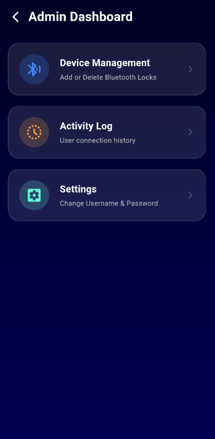
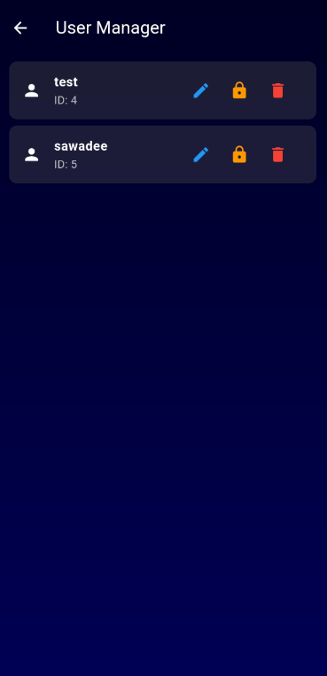
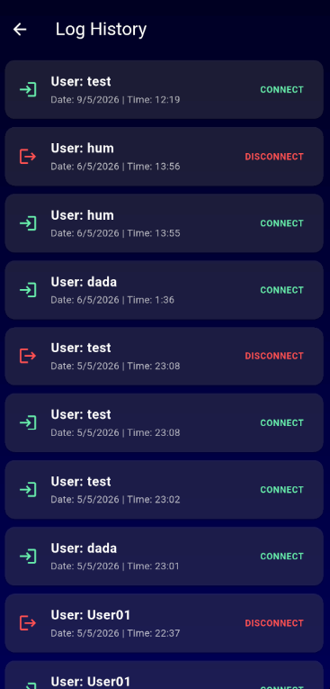
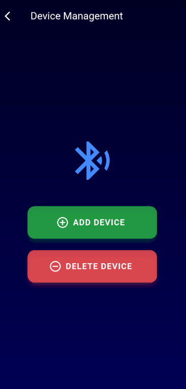

## application 

Mobile Application is a Flutter-based mobile application developed as a prototype for a smart lock management system. The application simulates user authentication, connection monitoring, activity logging, and user management features through a mobile interface.

## Features
-Authentication
-User Registration
-SQLite Database Storage
-Simulated Connect / Disconnect Status
-Activity Log
-SQLite Local Database Storage
-Admin Interface

## UI

### Main Page

---

### Login

---

### Register

---

### Simulation

---

### Admin Dashboard

---

### Database User

---

### Log

---

### Add Delete Device

---

## Installation
git clone https://github.com/ken34109-debug/Project.git

cd Project

flutter pub get

flutter run

